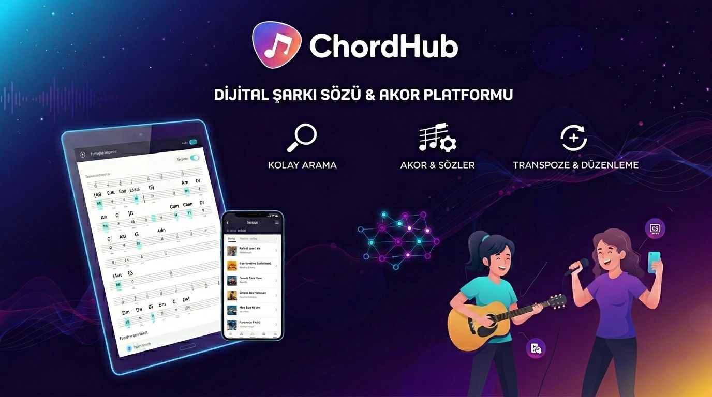

# ChordHub

## Proje Hakkında

**Proje Tanımı:** 

Bu proje, şarkı sözleri ve akor bilgilerini içeren kapsamlı ve kullanıcı dostu bir dijital repertuvar platformu geliştirmeyi amaçlamaktadır. Geliştirilecek sistem sayesinde kullanıcılar, aradıkları eserlere hızlı ve kolay bir şekilde erişebilecek; şarkı sözleri ve akor yapılarını tek bir arayüz üzerinden görüntüleyebilecektir.
Platformun sunduğu ton değiştirme (transpose) özelliği ile kullanıcılar, eserleri kendi ses aralıklarına ve performans ihtiyaçlarına uygun şekilde anında düzenleyebilecek; böylece repertuvarlarını kişiselleştirilmiş ve esnek bir yapıda yönetebilecektir.
Proje, özellikle müzisyenlerin sahne, prova ve bireysel çalışma süreçlerinde zamandan tasarruf etmelerini, repertuvarlarına düzenli ve pratik bir biçimde erişmelerini ve müzikal üretim süreçlerini daha verimli hale getirmelerini hedeflemektedir.
Dijital altyapısı sayesinde erişilebilir, sürdürülebilir ve ölçeklenebilir bir çözüm sunmayı amaçlayan bu sistem, geleneksel repertuvar kullanım alışkanlıklarını modern teknolojilerle birleştirerek müzik alanında işlevsel bir dijital dönüşüm sağlamayı hedeflemektedir.

**Proje Kategorisi:** 

Dijital Repertuvar

**Referans Uygulama:** 

[Örnek Referans Uygulama](https://www.repertuarim.com/)

---

## Proje Linkleri

- **REST API Adresi:** 
- **Web Frontend Adresi:** 

---

## Proje Ekibi

**Grup Adı:** 

Deve Dalgınmış Dinlememiş

**Ekip Üyeleri:** 
- Hilal AYYILDIZ
- Hatice Ezgi ORHAN

---

## Dokümantasyon

Proje dokümantasyonuna aşağıdaki linklerden erişebilirsiniz:

1. [Gereksinim Analizi](Gereksinim-Analizi.md)
2. [REST API Tasarımı](API-Tasarimi.md)
3. [REST API](Rest-API.md)
4. [Web Front-End](WebFrontEnd.md)
5. [Mobil Front-End](MobilFrontEnd.md)
6. [Mobil Backend](MobilBackEnd.md)
7. [Video Sunum](Sunum.md)

---
